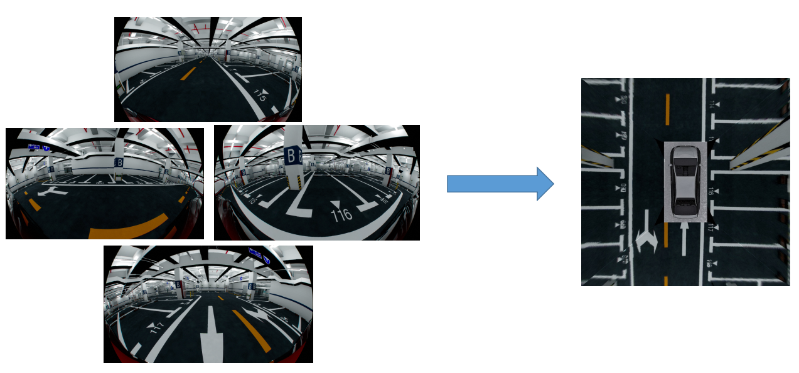

# Fisheye2BEV
This repo uses 4 fisheye images to synthesize a bird's eye view (BEV) image.
This process contains 3 steps as follows:
1. fisheye camera calibration in IntrinsicCalibration folder.
2. calculating IPM matrix in ExtrisicCalibration folder.
3. Synthesizing BEV image using 4 fisheye camera images in Synthesis folder.

